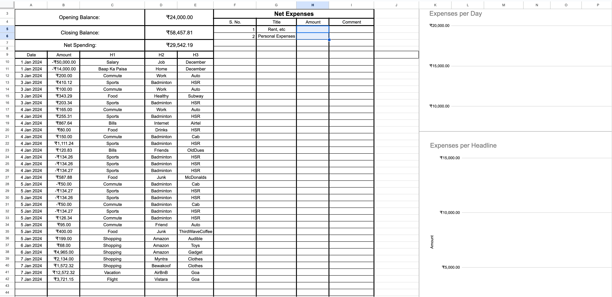

# Personal Financial Report Generator

 



## Motivation

I wished to track my expenses throughout the month and I wanted the process to be as automated as possible. 
Unfortunately banks with their legacy systems expose no APIs to collect my own banking data, except for crappy 
monthly statements organized into badly formatted pdfs. (They don't even use LaTeX!)

To figure a way around this I used Email alerts they send as the source of spending information for the expense reports

## Declaration

Although the required process only requires you to play around with and authenticate your google sheets account 
to read your emails and it requires you to enable Google sheets API. Both of which are harmless. Please follow this at 
your own risk. It's a side project for me and I might have missed some security issue. i.e. Use at your own risk

## Notes

1. The configuration I use is for my bank: `HDFC` and it's alerts. Please modify the regex filters based on your bank.
2. The final visualization I like is that of a Sankey Diagram as displayed in the preview. 
3. Currently I haven't figured a way to generate the Sankey Diagram automatically, Right now, at the end of the month I 
trigger the scripts and get the sankeyMatic input and copy it over to the sankeyMatic [website](https://sankeymatic.com/build/).
4. I then generate a png with `3000x2000` as dimensions and save the reports.


## Process

### Part 1: Getting UPI and CreditCard Spending Data into GoogleSheets

1. The first thing to do would be to create a google sheet to use as a data dump.
2. Then go to the corresponding scripts app using `Extensions > Apps Script`. 
3. Copy over the `src/GoogleSheetsApp/Code.js` to the editor.
4. Try to execute the function `getData` and give it the required permissions.
5. Reload googleSheet. You should see a custom menu called getData.
5. Whenever you wish to compile new transactions into the sheet just run getData from `getData > getData` on menu bar.
6. To check details/logs of the run you can go to the scripts app and `Executions` tab.
7. Ideally you should able to get your information like:

| Date       | Amount    | Payee                       | 
|------------|-----------|-----------------------------|
| 2 Jan 2024 | 	₹125.00  | 	q3555512349@ybl            |
| 3 Jan 2024 | 	₹1247.44 | 	paytm-642345820@paytm      |
| 4 Jan 2024 | 	₹345.21  | 	bradleymerabhai@ybl        |
| 4 Jan 2024 | 	₹147.28  | 	sastajackiechan@okhdfcbank | 

8. I personally Add two more columns and sanitize the transaction details like: 

| Date       | Amount    | H1        |  H2 | H3  |
|------------|-----------|-----------| --- |-----|
| 2 Jan 2024 | 	₹125.00  | 	Commute  | Work | Cab | 
| 3 Jan 2024 | 	₹1247.44 | 	Food     | Junk | Dominos |
| 4 Jan 2024 | 	₹345.21  | 	Shopping | Amazon | Cable |
| 4 Jan 2024 | 	₹147.28  | 	Shopping | Myntra | Diary |

9. The scripts later assume this format. Although you can personalize it to your liking.


### Part 2: Setting up GoogleSheets API
1. Go to the [Google Cloud Console](https://console.cloud.google.com/).
2. Create a new project by clicking on the project name in the top navigation bar and selecting "New Project."
3. In the left-hand navigation pane, click on "APIs & Services" > "Dashboard.
4. Click on the "+ ENABLE APIS AND SERVICES" button.
5. Search for "Google Sheets API" and enable it.
6. Choose `"Basic" > "Editor"` role for yourself.
7. Create credentials and create a service account.
8. Create service account key and download it into `keys.json`
9. Open your Google Sheet and click on the "Share" button. 
10. Share the sheet with the email address associated with the service account (present in the json).
11. You should now be able to access google sheets from cli

### Part 3: Running local python script to generate Sankey Input
1. Install the requirements by running:  
```bash
pip install -r requirements.txt
```
2. Run the provided `getDataAndGenerateReport.py` as
```bash
python3 getDataAndGenerateReport.py -m Jan -o Jan 
```
### Part 4: Using sankeyMatic to copy over the outputs
1. Copy the outputs over to [sankeyMatic](https://sankeymatic.com/build/) one by one 
    and choose height as `3000` and width as `2000` and download the two reports as png.

## Contributing
1. If you were able to find use for this repository, I'd appreciate a star. 
2. Feature requests are welcome and if you're unable to figure something out, feel free to open an issue in github.
3. Any help to automate the last part would be much appreciated. Basically the target is to use the awesome 
sankeyMatic [source code](https://github.com/nowthis/sankeymatic) to do the Part 4 task directly. 
4. That is, I wish to generate sankey diagram from the given input using either `bash` or `python` or `javascript`. 
I'm new to javascript, hence the difficulty automating.

## Contact
1. For any issues while working with the script please feel free to open an issue(recommended) or [email me](mailto:kajla.dhananjay@gmail.com)